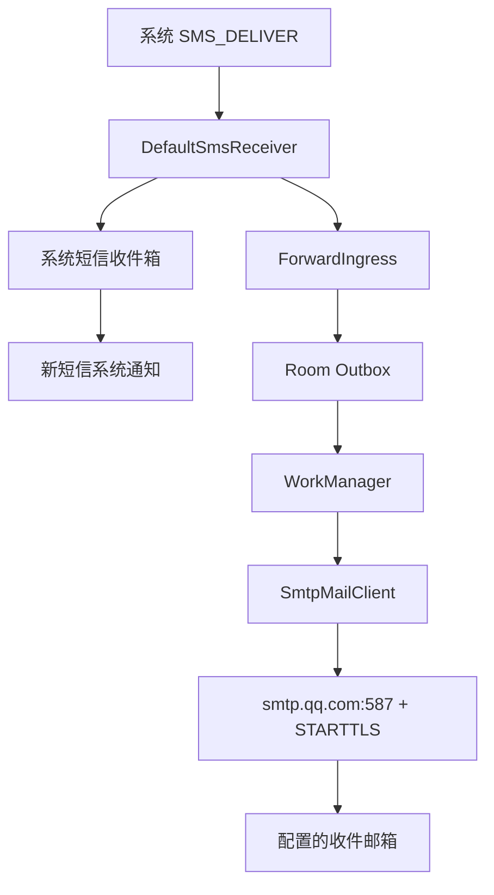
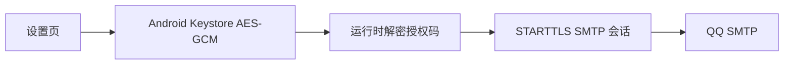

# SmsRelay 0.4.2 架构说明

## 目标

SmsRelay 是一个本地优先的 Android 短信转邮件应用。备用机收到 SMS 后，单个 APK 直接通过 QQ SMTP 把短信投递到用户配置的收件邮箱，不依赖自建服务器。

核心约束：

- 默认短信角色、系统短信收件箱和转发队列各自保持清晰边界；
- 应用进程退出或暂时离线时不丢失已经入队的任务；
- SMTP 授权码不进入源码、APK、日志或明文 SharedPreferences；
- 外部网络只允许经过证书和主机名校验的 TLS 连接；
- 失败可见、可重试，但不对 SMTP 做无法实现的严格幂等承诺。

## 运行时数据流



未取得默认短信角色时，应用仍保留 `SMS_RECEIVED` 兼容入口；但新版本 Android 可能过滤验证码等敏感短信，因此界面会明确标记为受限模式。

## 模块边界

| 层 | 核心类型 | 职责 |
| --- | --- | --- |
| 系统角色 | `SmsRoleManager` | 请求和检查默认短信应用角色 |
| 系统入口 | `DefaultSmsReceiver`、`SmsReceiver` | 接收默认角色与兼容模式短信广播 |
| 解析和入口 | `SmsParser`、`ForwardIngress` | 合并 PDU、写系统收件箱、去重入队 |
| 系统短信 | `SystemSmsRepository`、`SmsSendController`、`IncomingSmsNotifier` | 读取会话、已读状态、短信发送和新短信系统通知 |
| 数据 | `ForwardMessageEntity`、`ForwardMessageDao` | Room Outbox、状态和唯一索引 |
| 调度 | `ForwardScheduler`、`ForwardSmsWorker` | 唯一任务、指数退避和 SMTP 投递 |
| 配置 | `SettingsRepository`、`SmtpSettingsPolicy` | 独立发件/收件地址、运行开关和配置完整性 |
| 凭据 | `SecureCredentialStore` | Android Keystore AES-GCM 保存 SMTP 授权码 |
| 邮件 | `MailEnvelopeFactory`、`SmtpMailClient` | MIME、STARTTLS、认证和错误分类 |
| 引导 | `OnboardingRepository`、`OnboardingTour` | 首次启动步骤和系统授权入口 |
| 展示 | `MainViewModel`、`SmsRelayApp` | 状态、短信、记录、设置和链路测试 |

## 固定 SMTP 契约

```text
host = smtp.qq.com
port = 587
auth = true
STARTTLS = enabled + required
hostname verification = true
from = configured QQ sender email
to = configured recipient email
```

发件地址必须是 QQ 邮箱；收件地址可不同。应用不允许修改 SMTP 主机、端口或 TLS 类型，也不实现信任所有证书、关闭主机名校验或降级到明文连接。

## 状态机与失败语义

```text
PENDING -> SENDING -> SENT
              |\
              | -> RETRY -> SENDING
              -> FAILED -> PENDING（人工重试）
```

- SMTP 成功完成发送后标记为 `SENT`；
- 网络异常、超时和 SMTP 4xx 进入 `RETRY`，最多 8 次；
- 认证失败、地址拒绝和 SMTP 5xx 标记为 `FAILED`；
- 人工重试重置为 `PENDING` 并替换已有任务；
- 错误文案不包含账号、授权码、SMTP 会话或短信正文。

Room 唯一 `dedupeKey` 和唯一 WorkRequest 抑制设备内重复任务。邮件使用由本地记录 ID 稳定派生的 `Message-ID`。如果 QQ SMTP 已接受邮件，但设备在读取最终响应前断网，重试仍可能产生重复邮件。

## 凭据和外部入口



- 普通设置保存在应用私有 SharedPreferences；
- SMTP 授权码使用独立 Keystore alias；
- `allowBackup=false`，避免应用数据进入系统备份；
- `MainActivity` 仅作为 launcher 导出；
- 短信接收器要求系统短信权限保护；
- debug 构建包含仅用于 ADB 验收的 `DebugConfigReceiver`，release manifest 不包含该组件；
- release manifest 设置 `usesCleartextTraffic=false`。

## 构建与签名边界

公开仓库不包含维护者的 keystore 或密码。本地存在完整 `keystore.properties` 时，Gradle 使用该配置签名 release；缺失时可以构建 unsigned release，但不能直接安装或分发。GitHub Releases 中的官方 APK 由维护者本地签名并附 SHA-256。
