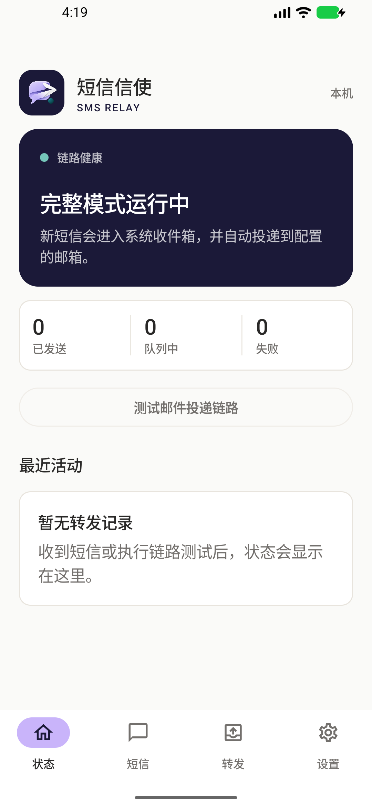
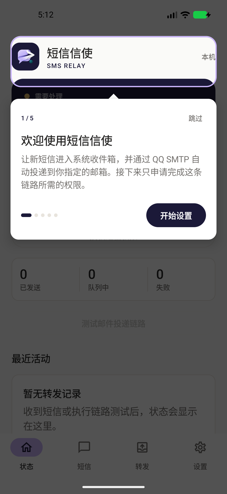

<p align="center">
  
</p>

<h1 align="center">短信信使 · SmsRelay</h1>

<p align="center">把 SIM 卡留在备用机，把新短信送到你随时能看的邮箱。</p>

<p align="center">
  <a href="https://github.com/Eki-Raku/SmsRelay/releases/latest"></a>
  
  
  <a href="LICENSE"></a>
</p>

> [!WARNING]
> 本项目由个人维护，未经独立安全审计，也未在任何应用商店上架。应用会读取短信并保存 SMTP 授权码，请只从本仓库的 Releases 下载，在你完全控制的备用机上自行评估使用。它不保证短信必达、实时或绝不重复。

## 它解决什么问题

有些手机号平时放在家里的备用机里，但验证码、快递、缴费和服务通知仍会发到这张 SIM 卡。短信信使让备用机在收到新短信后，自动把短信原文投递到你指定的邮箱。你不需要随身带着那台手机，也不需要部署服务器。

典型使用方式：

```text
家里的备用 Android 手机（插着 SIM 卡并联网）
  → 收到新短信
  → 短信信使写入本地队列
  → QQ SMTP + STARTTLS
  → 你随时可访问的收件邮箱
```

发件邮箱必须是已开启 SMTP 的 QQ 邮箱；收件邮箱可以是另一个 QQ 邮箱，也可以是其他邮箱。

## 主要能力

- 新短信自动转发到邮箱，不依赖自建服务器；
- 发件邮箱与收件邮箱独立配置；
- 支持成为系统默认短信应用，尽量可靠接收新版本 Android 上的验证码短信；
- 新短信提供横幅、声音、应用角标和点击直达会话；
- 自带会话搜索、未读状态、短信查看和发送能力；
- 本地队列、去重、指数退避重试、失败通知和人工重试；
- 后台常驻与开机自启；
- 首次启动分步完成短信角色、权限和邮箱配置；
- 明暗主题、大字体和专业克制的移动端界面。

<p align="center">
  
  &nbsp;
  
</p>

## 下载与安装

1. 打开 [Releases](https://github.com/Eki-Raku/SmsRelay/releases/latest)，下载文件名以 `release.apk` 结尾的安装包。
2. 使用同一 Release 中的 `SHA256SUMS` 核对安装包：

   ```bash
   shasum -a 256 -c SHA256SUMS
   ```

   Windows PowerShell 可运行：

   ```powershell
   Get-FileHash .\SmsRelay-0.5.0-release.apk -Algorithm SHA256
   ```

3. 在备用机上允许浏览器或文件管理器“安装未知应用”，然后打开 APK。
4. 安装完成后可关闭该来源的“安装未知应用”权限。

本项目没有在 Google Play、小米应用商店或其他商店发布。聊天群、网盘和第三方下载站中的同名 APK 均不是官方分发渠道。

## 第一次使用

### 1. 完成系统引导

首次启动会依次引导你：

1. 将短信信使设为默认短信应用；
2. 允许读取、接收和发送短信；
3. 允许通知；
4. 进入设置页配置邮件投递。

默认短信角色和短信运行时权限是两件事：即使应用已经是默认短信应用，仍需允许“读取短信”。短信信使会分别检查并提示。

> 设为默认短信应用后，系统会把新的短信交给短信信使。你仍可在应用的“短信”页面查看和发送短信，但原来的短信 App 将不再是默认处理程序。

### 2. 准备 QQ SMTP

1. 登录 QQ 邮箱网页端；
2. 在邮箱设置中开启 SMTP 服务；
3. 生成一个 SMTP 授权码，**不要填写 QQ 登录密码**；
4. 打开短信信使的“设置 → 邮件投递”；
5. 填写发件 QQ 邮箱、收件邮箱和 SMTP 授权码；
6. 保存后回到状态页，点击“测试邮件投递链路”。

应用固定使用：

| 项目 | 配置 |
| --- | --- |
| SMTP 主机 | `smtp.qq.com` |
| 端口 | `587` |
| 加密 | STARTTLS，强制校验证书和主机名 |
| 用户名 | 发件 QQ 邮箱 |
| 密码 | QQ 邮箱生成的 SMTP 授权码 |
| 收件人 | 你单独配置的一个邮箱地址 |

授权码保存后不会在界面中回显。显示“已配置”时，留空保存表示继续使用原授权码。

### 3. 让备用机稳定在线

备用机应保持联网和供电。不同厂商可能还需要额外设置：

- 允许短信信使自启动；
- 将电池策略设为“不限制”或允许后台活动；
- 在最近任务中锁定应用；
- 不要对短信信使执行“强行停止”；
- 小米 MIUI / HyperOS 用户请在系统设置或手机管家中检查自启动与省电限制。

Android 被用户“强行停止”后不会再向应用投递短信广播，必须手动重新打开一次短信信使。

### 4. 做一次真实验收

先点击“测试邮件投递链路”，确认邮箱能收到测试邮件；再从另一部手机给备用机发送一条普通短信，确认状态页出现发送记录且邮箱收到短信正文。完成这两步再把备用机长期放置。

## 权限为什么需要

| 权限或系统能力 | 用途 |
| --- | --- |
| 默认短信应用角色 | 接收系统 `SMS_DELIVER`，适配新版本 Android 对验证码短信的保护 |
| 读取、接收短信 | 展示系统短信并把新短信加入转发队列 |
| 发送短信 | 提供默认短信应用所需的短信发送功能 |
| 通知 | 展示后台常驻状态和失败提醒 |
| 开机启动 | 设备重启后恢复后台服务 |

应用当前不读取通讯录、不上传设备通讯录，也不需要位置、相机或麦克风权限。

## 投递与重试

- SMTP 接受邮件后，记录标记为“已发送”；
- 网络异常、超时和 SMTP 4xx 会使用 WorkManager 指数退避，最多尝试 8 次；
- 授权失败、地址拒绝和 SMTP 5xx 会标记为“失败”，可在转发页人工重试；
- 同一短信使用稳定的 `Message-ID`，但 SMTP 没有严格幂等接口，极端断连窗口仍可能产生重复邮件；
- 关闭“自动转发”期间收到的短信不会进入短信信使的转发队列。

邮件会优先把重要内容放进系统通知可见区域：验证码短信主题为 `[验证码] <企业/发送方> · <验证码>`，普通短信主题包含企业/发送方和正文摘要。正文先展示短信原文，再用字符分隔区展示来源号码、接收时间和 SIM 标签。常见的 `【企业签名】` 会用于展示名称，但原始来源号码始终保留。

## 隐私与安全

- Release 构建禁止明文网络，邮件通过 QQ SMTP STARTTLS 发送；邮件内容在到达收件箱后受邮箱服务商和账号安全策略约束，并不是端到端加密。
- SMTP 授权码使用 Android Keystore 保护，不写入源码或应用日志。
- 短信正文会存在于系统短信数据库、本地队列和收件邮箱中；清除应用数据只会删除本机配置和队列，不会删除邮箱副本。
- 建议使用专门的 QQ 发件邮箱，并为收件邮箱开启多因素认证。
- 手机丢失或怀疑泄露时，应立即在 QQ 邮箱中撤销 SMTP 授权码。

完整边界和安全问题报告方式见 [SECURITY.md](SECURITY.md)。

## 当前限制

- 仅支持 QQ SMTP 作为发件服务；
- 一次只能配置一个收件邮箱；
- 不支持附件、HTML 邮件或 OAuth；
- 不转发 MMS/RCS，收到 MMS 时只做明确提示；
- 企业名与验证码仅做本地规则识别，不提供联网号码标记、诈骗识别、白名单、黑名单或脱敏；
- 不承诺绕过所有厂商的后台限制，也不能替代运营商级短信同步服务。

## 常见问题

### 测试邮件成功，但真实短信没有转发

依次检查：短信信使是否为默认短信应用、读取短信权限是否允许、自动转发是否开启、后台常驻是否开启，以及厂商省电策略是否限制了应用。然后重新打开应用，再发送一条普通短信测试。

### 可以不设为默认短信应用吗？

应用保留兼容接收入口，但在较新的 Android 上，验证码等敏感短信可能不会交给普通第三方应用。想提高可用性，应将短信信使设为默认短信应用。

### 发件邮箱和收件邮箱必须相同吗？

不需要。发件邮箱必须是开启 SMTP 的 QQ 邮箱，收件邮箱可以单独配置为任意一个有效邮箱。

### 为什么收到了两封相同邮件？

应用会本地去重，但如果 SMTP 已接受邮件、手机却在收到成功响应前断网，重试可能造成重复投递。这是 SMTP 链路无法完全消除的边界。

## 从源码构建

项目使用 GitFlow 管理分支：`main` 只保存可发布版本，日常开发合入 `develop`；功能使用 `feature/*`，发布准备使用 `release/*`，线上紧急修复使用从 `main` 创建的 `hotfix/*`，完成后同时合回 `main` 与 `develop`。

要求 JDK 17、Android SDK 37，以及 Android Build Tools 36.0.0 或更新版本。

```bash
./gradlew testDebugUnitTest assembleDebug
```

Debug APK 位于 `app/build/outputs/apk/debug/app-debug.apk`。

如需构建自己的签名 Release：

1. 生成自己的 Android keystore；
2. 将 `keystore.properties.example` 复制为 `keystore.properties` 并填写本机绝对路径和密码；
3. 运行 `./gradlew assembleRelease`。

没有 `keystore.properties` 时也可执行 `assembleRelease`，但产物不会签名，不能直接安装或分发。项目维护者的 keystore 和密码不会进入公开仓库。

## 许可

源码按照 [PolyForm Noncommercial License 1.0.0](LICENSE) 提供，只允许许可条款定义的非商业用途。商业部署、商业集成、销售、收费服务或其他商业用途不在授权范围内。

由于商业用途被限制，本项目属于 **source-available（源码可用）**，而不是 OSI 定义的开源软件。提交代码即表示你理解项目仍按同一非商业许可发布。
